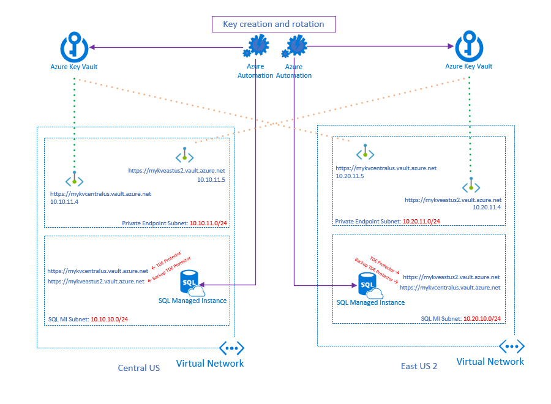

This example architecture describes how customers can manage their own Transparent Data Encryption (TDE) keys for SQL Managed Instances in a cross-region, auto-failover group using using Azure Key Vault. It provides high availability, high security, and high resiliency. It also ensures that traffic used to transport encryption keys stays within the customer's VNET using Private Link / Private Endpoint.

>For added service continuity, both SQL Server Instances are configured to use the Key Vault in its region as primary, and the Key Vault in the remote region as secondary.

>The secondary Key Vault instance, while in another region, has a Private Endpoint in the same region as the SQL instance. So, as far as a SQL Instance is concerned, requests made to both primary and secondary Key Vaults are logically within the same region. 

## Potential use cases

This architecture can be used for just about any industry but is essential for achieving the highest level of security, resiliency, and service continuity. If you don't require managing the TDE keys for compliance reasons, service-managed keys is a much simpler and just as secure option.

## Architecture

Flow

1. Every 10 minutes, SQL Managed Instance will check to make sure it can access the TDE wrapper at the Key Vault defined as primary. 

2. If a Key Vault becomes unavailable, and is set as the primary on a SQL Instance, that instance will check the Key Vault set as secondary. If that Key Vault is also unavailable, SQL Managed Instance will mark the databases as "inaccessible" (source).

### Components

- [Azure Key Vault](https://azure.microsoft.com/services/app-service)
- [Azure SQL Managed Instance](https://azure.microsoft.com/services/bot-service)
- [Private Endpoint](https://azure.microsoft.com/services/cognitive-services/language-understanding-intelligent-service)

### Alternatives
The alternative to customer-managed TDE keys is Service-Managed TDE Keys. This offloads much of the work the customer would do with CMK (customer-managed keys) but also provides the same level of security. 

## Considerations

### Key Management Considerations
Your method of Key Rotation will differ depending on what you are using to create your TDE asymmetric keys. When you bring your own TDE wrapper key, you have to decide how you will create this key. Your options are:

    1. Have Azure Key Vault create the key. This option ensures that the private key never leaves Azure Key Vault and cannot be seen by any human. The private key is not exportable but can be backed up and restored to another Azure Key Vault, which is going to be necessary in order to get the same key in multiple Key Vaults. The limitation with this option is that both Key Vaults have to be in the same region or the restore won't work.

    2. Use a supported on-premises Hardware Security Module (HSM). Using a supported HSM, you can import keys into Azure Key Vault, securely. The same-geography limitation does not apply here.

    3. Generate it using anything else (such as OpenSSL) and import the key into Azure Key Vault. This option gives you the most flexibility but can be the least secure without strict policies in place. The system generating the keys and the method used to place the keys in Azure Key Vault are not controlled by Azure.

### Availability
By adding Azure Key Vault to your architecture, it becomes a critical component and at least one of the Key Vaults in the design must be accessible. Additionally, the keys necessary for TDE must be accessible. Azure Monitor Insights provides comprehansive monitoring of Azure Key Vault. More information can be found here: [source](https://docs.microsoft.com/en-us/azure/azure-monitor/insights/key-vault-insights-overview)

### Operations
Because Azure SQL Managed Instance and Azure Key Vault are managed services, when it comes to operating this solution, the only components that require managing are the ones you're choosing to manage: Your TDE wrapper key. 

### Performance
SQL Managed Instance auto-failover groups performce significantly better when using paired regions as opposed to not using paired regions (link to source)

### Scalability
Because the focus of this document is the self-management of the TDE wrapper keys, we won't discuss the scalability of SQL Managed Instance but rather Azure Key Vault. The requests being made to Azure Key Vault are minimal (every 10 minutes) [source](source), therefore, scaling of the Key Vault will not be an issue. However, if there does happen to be throttling, or another incident which prevents the Key Vault from being responsive enough to service SQL MI, SQL will fail over to the secondary Key Vault to service its requests. 

### Security
The biggest security consideration is ensuring you keep your TDE wrapper key safe. Microsoft recommends using service-managed keys to take this burden off the customer.

### Resiliency
Each SQL Instance is configured to use two Key Vaults. If an instance's primary Key Vault is unavailable, it will attempt to find the key with a matching thumbprint in the secondary Key Vault. If there is no secondary Key Vault configured, it will continue to try the primary for 10 minutes. If it does not because accessible, SQL Managed Instance will mark the databases as *down*. (source)

### DevOps
Azure DevOps can be used to automate the process used for [Key Rotation](source).

## Deploy This Scenario
This scenario can be deployed by using the following ARM templates:
[ARM Templates](source).

## Pricing
Enter Key Vault pricing, HSM pricing, etc.

## Next Steps
???

## Related Resources
??